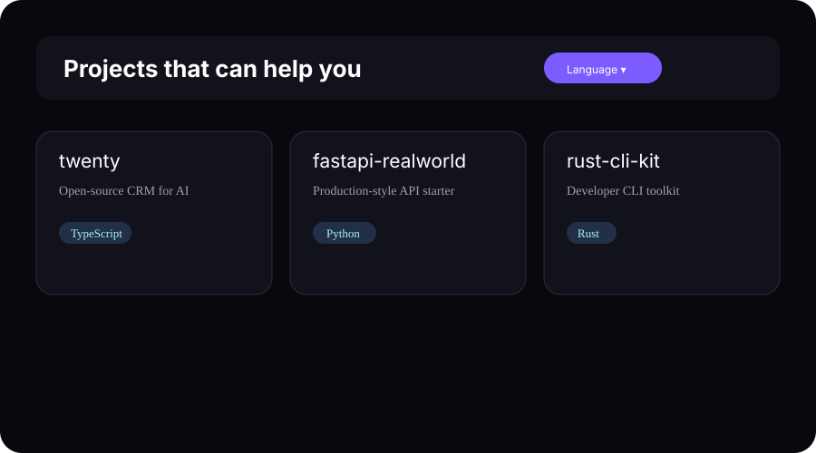
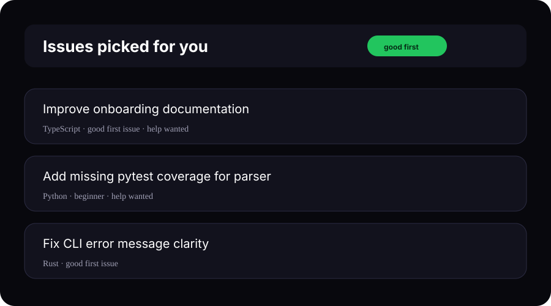

<div align="center">


# DevDating

**Find open-source projects and beginner-friendly GitHub issues — instantly.**

[](https://www.npmjs.com/package/devdating)
[](https://github.com/v01dst/devdating)
[](./LICENSE)

</div>

## ✨ Install Globally

```bash
npm install -g devdating@latest
devdating install
```

Start:

```bash
cd ~/.devdating
./bin/devdating up
```

Or use the global CLI directly:

```bash
npx devdating up
```

Open:

- **Projects:** http://localhost:3000/projects
- **Issues:** http://localhost:3000/issues

<div align="center"></div>

## 🚀 What You Get

| Feature | Description |
|---|---|
| 🔍 Project Discovery | Search repositories by language, topic, activity, and stars |
| 🐞 Beginner Issues | Filter real GitHub issues by language and labels |
| ⚡ Bulk Sync | Index hundreds or thousands of issues from GitHub |
| 🧠 Personal Matching | Detect your languages from your GitHub profile |
| 💬 Community Questions | Discover questions in similar projects |

## 📦 Commands

```bash
devdating up                    # Start API + web app
devdating sync-me               # Personalize from GitHub profile
devdating sync-bulk 500         # Index 500 issues
devdating enrich-languages      # Improve repository metadata
devdating status                # Check services
devdating stop                  # Stop services
```

## 🧭 Screens

### Projects
Browse contribution-ready public repositories.



### Issues
Search real beginner-friendly GitHub issues.



## ⚙️ Requirements

- Node.js 18+
- Python 3.11+
- Git

Docker is optional.

## 📄 License

MIT
