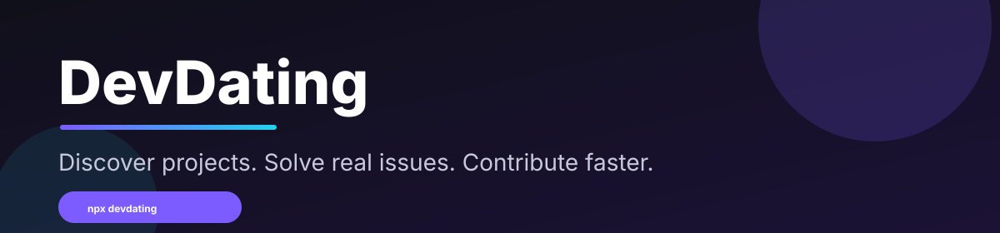
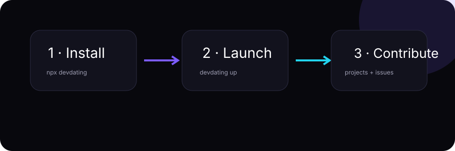

<div align="center">



# DevDating

**Swipe. Match. Contribute.**

The fastest way to find real open-source projects and beginner-friendly issues worth solving.

DevDating scans public GitHub repositories, understands your technical profile, and turns thousands of open issues into a focused, searchable contribution feed. No endless GitHub searching. No random "awesome lists." Just relevant projects and actionable issues.

[](https://www.npmjs.com/package/@v01dst/devdating)
[](https://www.npmjs.com/package/@v01dst/devdating)
[](https://github.com/v01dst/devdating)
[](./LICENSE)

</div>

---

## 💡 The Idea

Most developers want to contribute to open source, but they get stuck before writing any code:

- "Which project should I choose?"
- "Is this issue actually beginner-friendly?"
- "How do I know the project is active?"
- "Where are good first issues in my language?"

**DevDating solves discovery first.** It indexes public repositories and real GitHub issues, then scores every project against your profile:

| Signal | What it checks |
|---|---|
| **Language overlap** | Your tech stack vs. project languages (40 pts) |
| **Experience fit** | Project difficulty vs. your level (30 pts) |
| **Activity** | Stars, forks, and open-issue momentum (20 pts) |
| **Demand** | Open issues vs. contributor capacity (10 pts) |

Projects with zero technology overlap score 0 — you never see irrelevant cards. Swipe right on what fits, get matched at **65+**, and receive a starter issue recommendation for every match.

<div align="center">

</div>

## 👥 Who Is This For?

| You | What you get |
|---|---|
| **New contributors** | Approachable `good first issue` tasks in your language — no hours lost searching GitHub |
| **Students & career switchers** | A real public portfolio built on active projects instead of tutorials |
| **Working developers** | Discovery by language, topic, activity, ecosystem, and maintenance signal |
| **Open-source maintainers** | Make your repository discoverable through topics, labels, and healthy metadata |
| **Hackathon teams** | Instantly locate open tasks in TypeScript, Python, Go, Rust, Java, C++, and more |

## 🚀 Quick Start

```bash
npm install -g @v01dst/devdating@latest
devdating install
devdating up
```

Or without a global install: `npx @v01dst/devdating up`

Then open:

| Page | URL |
|---|---|
| Projects | http://localhost:3000/projects |
| Issues | http://localhost:3000/issues |
| Community Questions | http://localhost:3000/community |
| API Docs | http://localhost:8000/docs |

> The app uses a portable local SQLite database by default — no PostgreSQL needed. Docker is optional.

## 🧭 First Run Walkthrough

### 1. Personalize from GitHub

```bash
devdating sync-me
```

Reads your connected GitHub profile, detects your most-used languages, and updates your contributor preferences.

### 2. Index projects and issues

```bash
devdating sync-bulk 500     # start here
devdating sync-bulk 2500    # bigger dataset
```

Searches GitHub across TypeScript · JavaScript · Python · Go · Rust · Java · Kotlin · Swift · C · C++ · C# · PHP · Ruby · Dart · Elixir · Lua · Scala · Haskell · Solidity · Vue · Svelte.

### 3. Improve project metadata

```bash
devdating enrich-languages
```

Some repositories don't expose complete language data through search alone — this fills it in via the GitHub languages API.

### 4. Discover

- **`/projects`** — filter by language, keyword, topic; sort by activity, stars, open issues, or name. Every card shows description, languages, stars, forks, open issues, activity score, and license.
- **`/issues`** — filter by language, `good first issue`, `help wanted`, documentation, or free text. One click jumps straight to GitHub.
- **`/community`** — question-style discussions from indexed projects, useful for building context before submitting code.

## 📦 CLI Reference

| Command | Purpose |
|---|---|
| `devdating install [--mode docker\|native]` | Download dependencies and initialize the database |
| `devdating up [--seed]` | Start web + API services (safe to re-run) |
| `devdating serve` | Attached foreground process keeping both services alive |
| `devdating stop` / `restart` | Stop or restart services |
| `devdating status` | Show service state with PIDs |
| `devdating logs [api\|web]` | Tail service logs |
| `devdating seed` | Load demo projects and a developer profile |
| `devdating setup-ui` | Polished local installer UI on port 3100 |
| `devdating doctor` | Check required tools |
| `devdating update` | Pull updates and reinstall dependencies |
| `devdating uninstall` | Stop services and remove generated files |
| `devdating sync-me` | Detect your GitHub languages and update your profile |
| `devdating sync-bulk <count>` | Bulk-index beginner-friendly GitHub issues |
| `devdating sync-questions` | Index community question-style issues |
| `devdating enrich-languages` | Improve repository language metadata |

## 🛠 Tech Stack

| Layer | Technology |
|---|---|
| Frontend | Next.js 14, React 18, Tailwind CSS, Framer Motion, TanStack Query |
| Backend | FastAPI, SQLAlchemy 2 (async), Pydantic v2 |
| Database | SQLite (portable local mode) · PostgreSQL supported |
| Data source | GitHub REST API |
| Deployment | Docker Compose, Kubernetes manifests in [`infra/k8s`](./infra/k8s) |

## 🖥 Local Development

```bash
git clone https://github.com/v01dst/devdating.git
cd devdating
cp .env.example .env
docker compose up --build          # Docker mode
```

Native mode instead:

```bash
./bin/devdating install --mode native
./bin/devdating up
```

Run backend tests:

```bash
cd api && pytest
```

Build the frontend:

```bash
cd web && npm install && npm run build
```

## 🔧 Troubleshooting

<details>
<summary><b>Website not working after <code>devdating up</code></b></summary>

You likely have two installations fighting over port 8000 (e.g. `~/.devdating` from an older global install). The launcher now detects this and fails loudly instead of reporting false-ready. To clean up:

```bash
devdating stop                 # stop everything in this copy
pkill -f "uvicorn app.main"   # kill strays from other installs
pkill -f "next-server"
devdating up                   # fresh start
```
</details>

<details>
<summary><b>No issues or projects listed</b></summary>

The database starts empty. Populate it: `devdating sync-bulk 500`. A `GITHUB_TOKEN` environment variable raises API rate limits significantly.
</details>

<details>
<summary><b>Upgrade an existing installation</b></summary>

```bash
npm install -g @v01dst/devdating@latest
devdating update
```

Schema changes ship as Alembic migrations and apply automatically during `devdating install` / `devdating update`. If `install` fails on a database created before migrations existed, baseline it once:

```bash
cd ~/.devdating/api
../.venv/bin/alembic stamp a58003a00ec6   # mark pre-migration tables as the baseline
../.venv/bin/alembic upgrade head         # apply everything after it
../.venv/bin/python ../scripts/backfill_issue_difficulty.py   # score legacy issues (optional)
```

Then refresh stale data: `devdating sync-me && devdating sync-bulk 1000 && devdating enrich-languages`.
</details>

<details>
<summary><b>Authentication</b></summary>

DevDating uses hybrid auth. Without GitHub OAuth credentials it runs in single-user local mode — no login needed. Set `GITHUB_CLIENT_ID` + `GITHUB_CLIENT_SECRET` (and optionally `GITHUB_REDIRECT_URL`, `WEB_ORIGIN`) to enable real sign-in: the API then issues HMAC-signed session cookies via `/api/v1/auth/github/login → /callback`, and unauthenticated requests get `401`.

The web app proxies API calls through same-origin `/backend/*`, so cookies just work in development without CORS setup.
</details>

## 🗺 Roadmap

- ✅ Public project discovery
- ✅ Real GitHub issue indexing
- ✅ Language-aware filtering & scoring
- ✅ Bulk GitHub sync
- ✅ Community question discovery
- ✅ Dated operational records ([`records/`](./records))
- 🔜 Maintainer profiles and project claiming
- 🔜 Two-way matching between maintainers and contributors
- 🔜 Direct chat after match
- 🔜 Smart issue recommendations with difficulty scoring
- 🔜 Contribution tracking from issue to merged pull request

## 🤝 Contributing

1. Fork the repository.
2. Create a branch.
3. Make a focused change.
4. Run tests (`cd api && pytest`) and build checks (`cd web && npm run build`).
5. Log your run: `./scripts/record.sh tests "..."` — see [`records/README.md`](./records/README.md).
6. Open a pull request with a clear explanation.

Good first contributions: UI improvements, accessibility fixes, tests, docs, filters, sorting options, and GitHub ingestion improvements.

## 📬 Contact & Support

Discord: `9p.1`

GitHub Issues: https://github.com/v01dst/devdating/issues

## 📄 License

MIT — see [`LICENSE`](./LICENSE).
